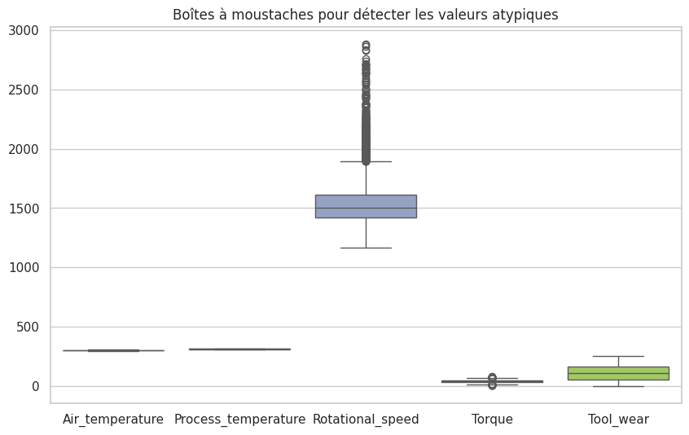
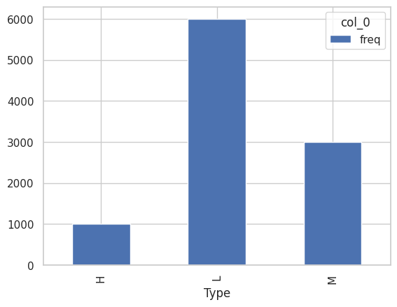
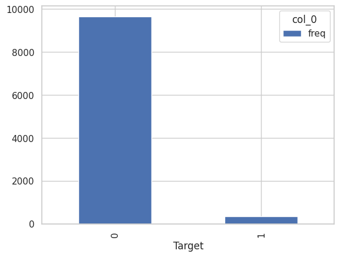
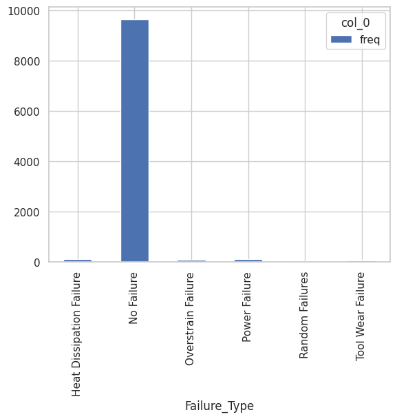
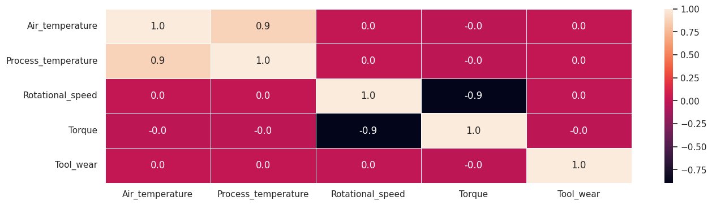
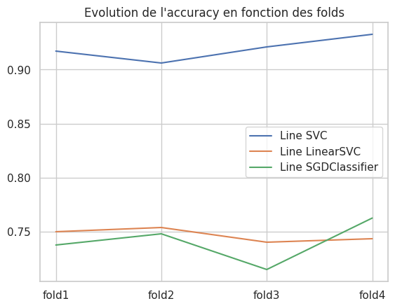
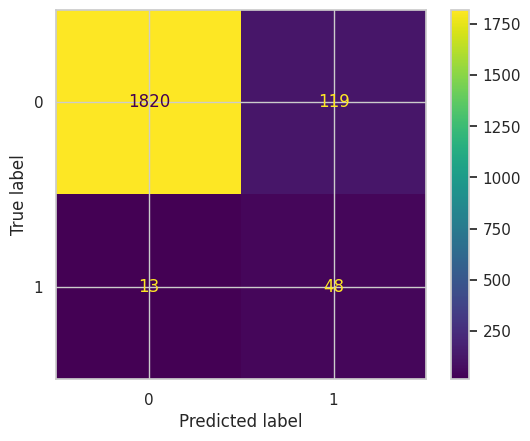
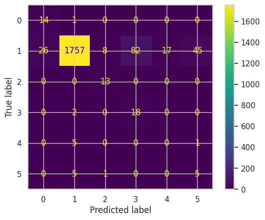
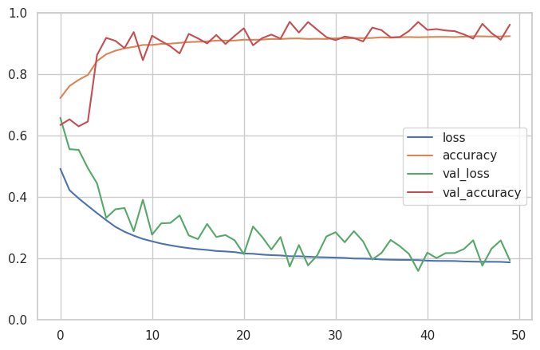

<h1>Classification sur la maintenance prédictive de machines</h1>

### Yohann TESSON

&nbsp;

## I-Introduction :

L'objectif de cette étude est de réaliser différents modèles SVM (Support Vector Machine) et de réseaux de neurones afin de pouvoir prédire des futures pannes de machines. Ceci permettra d'anticiper leur maintenance. Pour ce faire nous allons procéder à deux types de classification. Une première classification sera binaire (échec ou non de la machine) et une deuxième sera multiclasse (type de panne). Pour réaliser cette analyse nous disposons d'une base de données téléchargée préalablement sur le site kaggle (https://www.kaggle.com/datasets/shivamb/machine-predictive-maintenance-classification). C'est une base de données constituée de 10000 observations pour 10 variables. Les variables fournis sont les suivantes :

  Variables explicatives : 
  
  - UID : identifiant allant de 1 à 10000.
  - Product ID : le numéro de série de la machine.
  - Type : correspond à la qualité de produit avec L (faible), M (moyenne) et H(élevée).
  - Air temperature [K] : correspond à la température de l'air en Kelvin.
  - Process temperature [K] : correspond à la température du processus en Kelvin.
  - Rotational Speed [rpm] : correspond à la vitesse de rotation calculée en tours par minute à une puissance de 2860 W.
  - Torque [Nm] : correspond au couple calculé en Newton mètre (Nm).
  - Tool wear [min] : correspond à l'usure de l'outil en minutes. Les variantes H/M/L ajoutent respectivement 5/3/2 minutes au processus.

  Variables cibles :
  
  - Target : Variable cible binaire prenant les valeurs 0 (pas d'échec) et 1 (échec).
  - Failure Type : Variable cible catégorielle prenant en compte les différents types d'échec.

## II-Analyse Exploratoire :

Dans cette partie nous allons explorer la base de données afin de comprendre d'avantage sur les variables ainsi que les relations entre elles. Cette vue d'ensemble nous permettra par la suite de préparer la base de données pour la modélisation.

### Valeurs manquantes :

Pour commencer nous avons tout d'abord vérifier s'il y avait la présence de valeurs manquantes dans notre base de données. Le fait d'en avoir pourrait compromettre la modélisation. Les données fournies par le site de Kaggle sont souvent de bonne qualité, il est rare d'en trouver. Nous n'avons sans surprise aucune valeurs manquantes. 

### Statistiques descriptives des variables quantitatives :

#### Tableau 1 : Statistiques descriptives des variables quantitatives

|	    | Air_temperature |	Process_temperature |	Rotational_speed | Torque	| Tool_wear |
|-----|-----------------|---------------------|------------------|--------|-----------|
|count|	10000.000000    |	10000.000000        |	10000.000000	   | 10000.000000    | 10000.000000 |
|mean |	300.004930	    | 310.005560          |	1538.776100	     |39.986910	       | 107.951000 |
| std |	2.000259	      | 1.483734            |	179.284096	     | 9.968934        |	63.654147 |
|min  | 295.300000      |	305.700000          |	1168.000000      |	3.800000	     | 0.000000   |
|25%  |	298.300000      |	308.800000          |	1423.000000      |	33.200000      |	53.000000 |
|50%  |	300.100000      |	310.100000	        | 1503.000000      |	40.100000	     | 108.000000  |
|75%  |	301.500000      |	311.100000	        | 1612.000000	     | 46.800000       | 162.000000 |
|max  |	304.500000      |	313.800000	        | 2886.000000	     | 76.600000       | 253.000000 |

Le tableau des statistiques descriptives nous permet de déceler des différences d'échelle entre les variables. Il sera donc souhaitable de les standardiser, c'est à dire de soustraire les variables par leur moyenne, le tout en les divisant par leur écart-type. Ceci permet de pouvoir comparer les variables entre-elles indépendament de leur unité, tout en réduisant les temps de calcul lors des modélisations. 
Au vue de leur moyenne, les variables Torque et Tool_wear disposent d'un écart-type plus important comparées aux variables Ait_temperature et Process_temperature.

On vérifie ensuite si les différentes variables quantitatives suivent une loi normale. Pour cela nous utilisons le test de normalité de Shapiro-Wilk qui pose comme hypothèse nulle la présence d'une loi normale. Au vue des résultats, seul la variable Torque est normalement distribuée. On peut le confirmer visuellement à l'aide des graphiques ci-dessous :

#### Graphique 1 : Histogrammes des variables quantitatives

Nous allons ensuite faire une analyse des valeurs atypiques sur ces mêmes variables à l'aide de boxplots. Le graphique ci-dessous, nous montre la présence de plusieurs valeurs atypiques au niveau des variables Rotational_speed et Torque. Pour la première variable les valeurs sont situées uniquement sur la partie supérieure de la boîte à moustache. Pour la seconde, elles sont situées de part et d'autre du boxplot.

#### Graphique 2 : Boxplots des variables quantitatives

Au total, nous avons décelé 459 observations atypiques. Nous allons les corriger en les remplaçant par la médiane des variables respectives.

### Statistiques descriptives des variables qualitatives :

Les tableaux et les graphiques ci-dessous, nous montrent la répartition des modalités de chaque variable qualitative.

#### Variable explicative Type :

##### Tableau 2 : Répartition des modalités de la variable Type

| Type | freq |
|------|------|
| H	 | 1003 |
| L  | 6000 |
| M  | 2997 |

On voit qu'ici, les produits de faible qualité (L) sont représentés à 60% contre 10% pour les produits de haute qualité (H) et 30% pour les produits de moyenne qualité (M).

##### Graphique 3 : Répartition des modalités de la varibale Type

#### Variable cible Target :

##### Tableau 3 : Répartition des modalités de la variable Target

| Target | freq |
|--------|------|	
| 0 |	9661 |
| 1 |	339  |

Pour cette variables, on voit que le taux d'échec est représenté à 3% contre 97% de non échec. La répartition est donc déséquilibrée. Il faudra penser rééquilibrer la classe minoritaire (Méthode d'Oversampling, SMOTE,...).

##### Graphique 4 : Répartition des modalités de la variable Target 

#### Variable cible Failure_type :

##### Tableau 4 : Répartition des modalités de la variables Failure_type

| Failure_Type | freq |
|--------------|------|	
| Heat Dissipation Failure |	112 |
| No Failure | 9652 |
| Overstrain Failure | 78 |
| Power Failure |	95 |
| Random Failures |	18 |
| Tool Wear Failure |	45 |

On voit ici, que les non-échec sont représentés, comme pour la variable Target, à 97% contre 3% pour l'ensemble des types d'erreur.
Les modalités étant déséquilibrées, il faudra penser à recalibrer les modalités minoritaires.

##### Graphique 5 : Répartition des modalités de la variable Failure_type

On voit qu'il y a 6 types d'erreur qui sont les suivantes :

  - Défaut de dissipation de la chaleur
  - Pas d'échec
  - Défaillance due à la surcharge
  - Panne d'électricité
  - Défauts aléatoires
  - Défaut d'usure de l'outil

### Analyse des corrélations :

L'analyse des corrélations des variables quantitatives permet de déterminer la force des relations linéaires entre les variables. Elle permet également de faire une sélection de variables. Si deux variables sont corrélées, elles captent la même information. Il est donc préférable d'utiliser l'une d'entre elles afin de ne pas fausser la modélisation.

#### Graphique 6 : Matrice des corrélations des variables quantitatives

Sur ce graphique, on peut voir qu'il y a deux relations de corrélation. Une positive entre Air_temperature et Process_temperature à 0.9 et une négative entre Rotational_speed et Torque à -0.9. Dans la logique, il faudrait supprimer deux variables pour ne pas avoir un surplus d'informations, mais cela ne nous laisserait que 3 variables explicatives. Nous allons, dans un premier temps, continuer l'analyse avec les 5 variables et voir pour les supprimer dans un second temps.

Pour vérifier les corrélations entre les variables qualitatives, on réalise un test de chi-deux sous hypothèse nulle d'indépendance des variables. On a effectué ce test entre les variables cibles et la variable Type. On a trouver pour les deux relations, une relation de dépendance. Ceci confirme donc l'importance de la variable Type pour expliquer les deux variables cibles.

### Préparation de la base de données pour la modélisation :

#### Standardisation de la base de données :

Comme certains algorithmes de machine learning sont sensibles à l'échelle des variables, il est donc primordial de standardiser les variables quantitatives continues de la base de données. Ceci permet donc une meilleure stabilisation des modèles en réduisant la sensibilité aux grandes variations d'échelle entre les variables. Il donne non seulement des modèles plus robuste mais améliore aussi les temps de calcul.

Nous avons créé deux bases de données. Une base pour la classification binaire et une base pour la classification multiclasse.

#### Encodage des variables qualitatives :

On encode avec des valeurs numériques les modalités des variables cibles et de la variable Type afin de pouvoir réaliser la modélisation.

#### Division de la base de données en sous-échantillon :

On divise la base de données en deux échantillons. Un échantillon train qui permettra aux algorithmes d'apprendre sur ces données et un échantillon test pour calculer la performance de prédiction. Pour faire ceci, nous avons utilisé la fonction train_test_split du package sklearn.model_selection. Nous avons paramétré la fonction pour qu'il y ait 80% des observations de la base données dans l'échantillon train et 20% dans l'échantillon test.

#### Réajustement des échantillons train par Oversampling :

Comme nous observons un déséquilibre important entre les modalités des deux variables cibles, nous allons réajuster les classes minoritaires afin de les équilibrer à la classe la plus importante. Nous utilisons pour ceci la méthode oversampling. Ceci permettra aux algorithmes de machine learning d'apprendre plus facilement sur les données des classes minoritaires afin de faire de meilleures prédictions. 
L'oversampling consiste à augmenter artificiellement le nombre d'instances de la classe minoritaire pour équilibrer davantage les classes.

#### Réajustement de l'échantillon train pour la cas de la classification multiclasse :

Pour le cas de la classification, en faisant un réajustement par oversampling de l'échantillon train, nous avons augmenté le nombre d'observations de 8000 à 46301. Ceci engendrera des temps de calcul plus long. Pour limiter ceci nous allons réduire l'échantillon train à 8000 observations tout en maintenant l'équilibre des modalités de la variable cible. Pour ce faire nous utilisons l'option stratify de la fonction train_test_split.

## III-Modélisations

### SVM

Un modèle SVM (Support Vector Machine) est un algorithme de machine learning utilisé pour la classification et la régression. Il appartient à la famille des méthodes d'apprentissage supervisé. L'objectif principal d'un SVM est de trouver un hyperplan qui sépare les données d'entraînement en classes distinctes. Un hyperplan est essentiellement un plan qui divise l'espace des carctéristiques de manière à maximiser la marge entre les exemples de différentes classes. Les exemples qui se trouvent le plus près de cet hyperplan sont appelés "vecteurs de support".

#### Classification binaire :

##### Modélisation avec paramètre par défaut :

Nous utilisons ici, trois types de modèles SVM pour la classification. Tout d'abord le modèle linearSVC qui est spécifiquement conçu pour la classification linéaire. Il utilise l'optimisation à base de méthodes de descente de gradient. Il y a ensuite le SVC qui est un modèle SVM standard capable de gérer à la fois des données linéaires et non linéaires. Enfin il y a le SGDClassifier qui est un modèle plus général qui utilise l'optimisation stochastique par descende de gradient. Il peut être plus rapide sur de grands ensemble de données mais il nécessite une mise à l'échelle appropriée des données.

Le tableau ci-dessous nous montre les scores de précisions après cross-validation sur 5 folds des trois modèles différents.

###### Tableau 5 : Evolution des scores de précision des trois modèles SVM 

|   | fold1 | fold2 | fold3 | fold4 | fold5 | modèle |
|---|-------|-------|-------|-------|-------|--------|
| 0 |	0.917125 | 0.906118 |	0.921010 | 0.932664 | 0.909003 | SVC |
| 1 |	0.750081 | 0.753966 |	0.740369 | 0.743606	| 0.738018 | LinearSVC |
| 2	| 0.737779 | 0.748139 |	0.715118 | 0.762706 |	0.738990 | SGDClassifier |

On voit d'après le tableau que le modèle SVC donne un meilleur score en terme d'accuracy. Nous allons donc retenir ce modèle pour l'optimisation des paramètres. Visuellement, cela donne le graphique suivant :

###### Graphique 7 : Evolution des scores de précision des trois modèles SVM

De plus, la variance du SVC semble plutôt correct ce qui montre une bonne stabilité du modèle.

##### Tunage du modèle SVC

Nous allons maintenant chercher à optimiser les paramètres du modèle SVC pour améliorer le score de précision. Pour cela nous allons faire un gridsearch sur les différents noyaux. Nous choisissons les noyaux linéaire, polynomiale et rbf. Le noyau linéaire est utilisé lorsque les données sont linéairement séparables dans l'espace d'origine. Le noyau polynomial est utile pour les données qui ne sont pas linéairement séparables et peuvent avoir des frontières de décision complexes. Enfin le noyau gaussien (RBF) est utilisé en raison de sa capacité à gérer des frontière de décision complexes. Nous allons également tester le coefficient de régularisation C qui permet de contrôler les pénalités appliquées aux erreurs de classifications. Un C plus petit permet une marge plus grande, même au prix de quelques erreurs de classificiation. Un C plus grand rend le modèle plus sensible aux erreurs d'entraînement, cherchant à les minimiser même au détriment d'une marge plus étroite (risque de surajustement).

Le modèle retenu est un modèle avec un paramètre C égale à 1000 et un noyau RBF. le score d'accuracy est de 96.7%. Le modèle semble avoir bien appris.

Cela nous donne comme précision pour l'échantillon test, un score de 93,4%. C'est un score proche de celui de l'échantillon train. Il ne semble pas y avoir de surapprentissage.

Le graphique ci-dessous nous donne la matrice de confusion de l'échantillon test.

###### Graphihque 8 : Matrice de confusion de l'échantillon test du modèle SVC binaire.

On voit sur cette matrice de confusion que les non-échecs sont bien prédits. Cependant les échecs pourraient être mieux prédits. En effet il y a 48 bonnes prédictions pour 119 faux-positifs et 13 faux-négatifs. Peut-être que cela pourrait être amélioré en changeant de méthode de réajustement d'échantillon, en supprimant les variables corrélés ou en changeant les paramètres à optimiser.

#### Classification multiclasse :

Pour la classification multiclasse, on a le choix entre deux types de classifications. Il y a OVR (one versus rest) et le OVO (one versus one). L'OVO construit un classificateur binaire pour chaque paire possible de classes. Si il y a N classes, OVO contruira (N*(N-1))/2 classificateurs binaires. Chaque classificateur binaire est entraîné sur un sous-ensemble de données composé uniquement des exemples de deux classes concernées. Lors de la prédiction, chaque classificateur donne un vote, et la classe avec le plus grand nombre de votes est choisie comme la classe finale.
OVR construit un classificateur binaire pour chaque classe, en le comparant à toutes les autres classes regroupées en une seule classe restante. Si il y a N classes, OVR construira N classificateurs binaires.Chaque classificateur binaire est entraîné sur un sous-ensemble de données où les exemples de la classe considérée sont positifs, et tous les autres exemples sont négatifs. Lors de la prédiction, chaque classificateur donne une mesure de confiance pour l'appartenance à sa classe respective, et la classe avec la plus grande mesure est choisie.

##### Modélisation avec paramètre par défaut 

La classification par défaut utilisé est la classification OVR (one versus rest). Celui ci nous donne un score de précision de 93,05%. Ce qui est plutôt bon.

##### Tunage du modèle SVC :

Pour le gridsearch nous allons chercher à optimiser trois paramètres que sont le coefficient de régularisation C, le noyau et le type de classification multiclasse. Ceci nous donne un modèle avec un paramètre C de 100, un noyau RBF et une classification OVO pour un score d'accuracy de 95.75%. Le score est meilleur que le modèle par défaut. Pour l'échantillon test nous avons obtenu un score de 90.35%. Les scores semble assez proches, il n'y a pas de suspicion d'overfitting.

###### Graphique 9 : Matrice de confusion de l'échantillon test du modèle SVC multiclasse

La matrice de confusion nous donne un bon nombre de bonnes prédictions pour les non-échecs. Cependant il y a certaines modalités qui sont mal prédites comme les pannes aléatoires (random failures). Le modèle pourrait être améliorer de la même manière que le modèle binaire.

### Réseau de neurones

Un ANN (Artificial Neural Network), est un modèle computationnel inspiré du fonctionnement du cerveau biologique. Il fait partie de la famille des modèles de Deep Learning. Un ANN est composé de plusieurs unités appelées neurones, organisées en couches. Les couches sont généralement réparties en trois types. Il y a tout d'abord la couche d'entrée (Input Layer). Cette couche reçoit les données en entrée du modèle. Chaque neurone dans cette couche représente une caractéristique ou une variable d'entrée. Il y a ensuite dans un second temps les couches cachées (Hidden Layers). Ces couches effectuent des transformations non linéaires des données d'entrée. Les réseaux de neurones peuvent avoir plusieurs couches cachées, et c'est la profondeur de ces couches qui caractérise le concept de "deep learning". Chaque neurone dans ces couches applique une transformation pondérée aux données d'entrée. Enfin il y a la couche de sortie (Output Layer). Cette couche produit les résultats de la prédiction ou de la classification. Le nombre de neurones dans cette couche dépend du type de tâche (classification, régression, etc.). Chaque neurone représente une classe ou une valeur de sortie. Les connexions entre les neurones sont associées à des poids qui sont ajustés pendant l'apprentissage du réseau. L'apprentissage est souvent réalisé par l'algorithme de rétropropagation (backpropagation), qui minimise une fonction de coût en ajustant les poids du réseau en fonction des erreurs de prédiction.

#### Classification binaire

##### Modélisation par défaut

Pour la modélisation par défaut nous allons utilisé qu'une seule couche cachée pour 100 neurones. La fonction d'activation sera une fonction ReLu (Rectified Linear Unit). Puisque c'est une classification binaire nous allons utilisé un seul neurone pour l'Output Layer avec comme fonction d'activation une sigmoïde (fonction utilisée pour la régression logistique). Comme choix d'optimiseur, nous utilisons celui d'Adam. L'optimiseur est un composant essentiel dans l'entraînement des réseaux de neurones artificiels (ANN). Il est utilisé pour ajuster les poids du réseau afin de minimiser la fonction de coût lors du processus d'apprentissage. L'objectif de l'optimisation est de trouver les valeurs optimales des poids qui permettent au réseau de fournir des prédictions les plus précises possibles sur les données d'entraînement. En ce qui concerne la fonction de perte nous allons utilisé, puisque c'est une classification binaire, la binary cross entropy.

Pour la modélisation nous paramétrons l'epoch à 50 et le batch size à 32. Une epoch représente une passe complète à travers l'ensemble de données d'entraînement pendant l'entraînement du modèle. L'entraînement d'un modèle se fait par itérations successives à travers l'ensemble de données d'entraînement, où chaque itération est appelée une epoch. Plus le nombre d'epochs est élevé, plus le modèle a d'occasions d'apprendre des motifs complexes dans les données d'entraînement. Cependant, il est important de surveiller les signes de surajustement (overfitting) lorsque le nombre d'epochs devient trop élevé, car le modèle peut commencer à s'ajuster trop précisément aux données d'entraînement et ne pas généraliser correctement sur de nouvelles données.

Le batch size représente le nombre d'échantillons d'entraînement utilisés dans une itération pour mettre à jour les poids du modèle. L'entraînement d'un modèle ne se fait pas sur l'ensemble de données complet à chaque itération, mais plutôt sur des lots (batches) plus petits. Le choix du batch size peut avoir un impact sur la vitesse d'entraînement et la quantité de mémoire requise. Un batch size plus grand peut accélérer l'entraînement car les mises à jour des poids sont effectuées moins fréquemment, mais cela peut nécessiter plus de mémoire. Un batch size plus petit peut nécessiter moins de mémoire mais l'entraînement peut être plus lent. Des valeurs courantes pour le batch size sont 32, 64, 128, etc.

Cette modélisation nous a donné comme valeur d'accuracy maximal de 91.57% pour un loss de 20.63.

###### Graphique 10 : Evolution de l'accuracy et du loss en fonction des epochs

Sur ce graphique on voit que la courbe de l'accuracy augmente avant de se stabiliser. De même pour la fonction loss qui diminue avant de se stabiliser. On peut supposer que le modèle à fini d'apprendre au bout de 20-30 epochs. Un accuracy élevé et une fonction loss faible est un bon signe d'un modèle performant.

Le score de précision pour l'échantillon test est de 90%. Ce score est proche de l'échantillon train. Il n'y a pas de suspicion de surapprentissage.

###### Tableau 6 : matrice de confusion de l'échantillon test de l'ANN binaire

|   | 0 | 1 |
|---|------|-----|
| 0 | 1759 | 180 |
| 1 |  13  | 48  |

On peut observer dans cet matrice de confusion que les non-échec sont bien prédits. Les échecs pourraient pourtant être amélioré. Il n'y a que 48 valeurs bien prédites pour 180 faux négatifs et 13 faux positifs.

##### Tunage du modèle par défaut :

Dans cette partie, on a essayé d'optimiser le modèle par défaut avec trois paramètres que sont le nombre de couche cachées, le nombre de neurones et l'optimiseur. Cependant, le gridsearch n'a pas pu fonctionner car les versions des packages keras et scikit-learn sont incompatibles. Il ne reconnaît pas les fonctions de perte.

#### Classification multiclasse :

##### Modélisation par défaut :

Pour le modèle par défaut de la classification multiclasse, on a opté pour qu'une seule couche couchée avec 100 neurones pour une fonction d'activation ReLu. On a paramétré la couche de sortie à 6 neurones car il y a 6 modalités. La fonction d'activation pour une classification multiclasse est la fonction softmax. l'optimiseur est celui d'Adam et la fonction loss est le sparse_categorical_crossentropy. 

Nous avons paramétré les epochs à 50 et le batch size à 32. Ceci nous donne un score de précision maximal de 93.45% pour une valeur de loss de 22.86.

