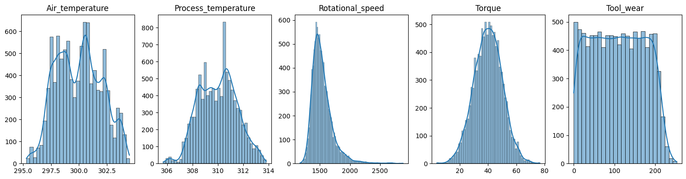

<h1>Classification sur la maintenance prédictive de machines</h1>

### Yohann TESSON

&nbsp;

## I-Introduction :

L'objectif de cette étude est de réaliser différents modèles SVM (Support Vector Machine) et de réseaux de neurones afin de pouvoir prédire des futures pannes de machines. Ceci permettra d'anticiper leur maintenance. Pour ce faire nous allons procéder à deux types de classification. Une première classification sera binaire (échec ou non de la machine) et une deuxième sera multiclasse (type de panne). Pour réaliser cette analyse nous disposons d'une base de données téléchargée préalablement sur le site kaggle (https://www.kaggle.com/datasets/shivamb/machine-predictive-maintenance-classification). C'est une base de données constituée de 10000 observations pour 10 variables. Les variables fournis sont les suivantes :

  Variables explicatives : 
  
  - UID : identifiant allant de 1 à 10000.
  - Product ID : le numéro de série de la machine.
  - Type : correspond à la qualité de produit avec L (faible), M (moyenne) et H(élevée).
  - Air temperature [K] : correspond à la température de l'air en Kelvin.
  - Process temperature [K] : correspond à la température du processus en Kelvin.
  - Rotational Speed [rpm] : correspond à la vitesse de rotation calculée en tours par minute à une puissance de 2860 W.
  - Torque [Nm] : correspond au couple calculé en Newton mètre (Nm).
  - Tool wear [min] : correspond à l'usure de l'outil en minutes. Les variantes H/M/L ajoutent respectivement 5/3/2 minutes au processus.

  Variables cibles :
  
  - Target : Variable cible binaire prenant les valeurs 0 (pas d'échec) et 1 (échec).
  - Failure Type : Variable cible catégorielle prenant en compte les différents types d'échec.

## II-Analyse Exploratoire :

Dans cette partie nous allons explorer la base de données afin de comprendre d'avantage sur les variables ainsi que les relations entre elles. Cette vue d'ensemble nous permettra par la suite de préparer la base de données pour la modélisation.

### Valeurs manquantes :

Pour commencer nous avons tout d'abord vérifier s'il y avait la présence de valeurs manquantes dans notre base de données. Le fait d'en avoir pourrait compromettre la modélisation. Les données fournies par le site de Kaggle sont souvent de bonne qualité, il est rare d'en trouver. Nous n'avons sans surprise aucune valeurs manquantes. 

### Statistiques descriptives des variables quantitatives :

#### Tableau 1 : Statistiques descriptives des variables quantitatives

|	    | Air_temperature |	Process_temperature |	Rotational_speed | Torque	| Tool_wear |
|-----|-----------------|---------------------|------------------|--------|-----------|
|count|	10000.000000    |	10000.000000        |	10000.000000	   | 10000.000000    | 10000.000000 |
|mean |	300.004930	    | 310.005560          |	1538.776100	     |39.986910	       | 107.951000 |
| std |	2.000259	      | 1.483734            |	179.284096	     | 9.968934        |	63.654147 |
|min  | 295.300000      |	305.700000          |	1168.000000      |	3.800000	     | 0.000000   |
|25%  |	298.300000      |	308.800000          |	1423.000000      |	33.200000      |	53.000000 |
|50%  |	300.100000      |	310.100000	        | 1503.000000      |	40.100000	     | 108.000000  |
|75%  |	301.500000      |	311.100000	        | 1612.000000	     | 46.800000       | 162.000000 |
|max  |	304.500000      |	313.800000	        | 2886.000000	     | 76.600000       | 253.000000 |

Le tableau des statistiques descriptives nous permet de déceler des différences d'échelle entre les variables. Il sera donc souhaitable de les standardiser, c'est à dire de soustraire les variables par leur moyenne, le tout en les divisant par leur écart-type. Ceci permet de pouvoir comparer les variables entre-elles indépendament de leur unité, tout en réduisant les temps de calcul lors des modélisations. 
Au vue de leur moyenne, les variables Torque et Tool_wear disposent d'un écart-type plus important comparées aux variables Ait_temperature et Process_temperature.

On vérifie ensuite si les différentes variables quantitatives suivent une loi normale. Pour cela nous utilisons le test de normalité de Shapiro-Wilk qui pose comme hypothèse nulle la présence d'une loi normale. Au vue des résultats, seul la variable Torque est normalement distribuée. On peut le confirmer visuellement à l'aide des graphiques ci-dessous :

#### Graphique 1 : Histogrammes des variables quantitatives

Nous allons ensuite faire une analyse des valeurs atypiques sur ces mêmes variables à l'aide de boxplots. Le graphique ci-dessous, nous montre la présence de plusieurs valeurs atypiques au niveau des variables Rotational_speed et Torque. Pour la première variable les valeurs sont situées uniquement sur la partie supérieure de la boîte à moustache. Pour la seconde, elles sont situées de part et d'autre du boxplot.

#### Graphique 2 : Boxplots des variables quantitatives

